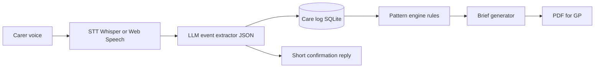

# Second Shift

**Turns two weeks of exhaustion into one page of evidence.**

A voice-first AI agent for **unpaid family carers of people with dementia in the UK**. The carer speaks naturally at home. Second Shift logs what happened, spots missed-medicine and symptom patterns, and generates an **evidence-cited GP / memory-clinic brief**.

**Start here:** [GUIDE.md](GUIDE.md) — section-by-section explanation of the research, the app, how to run it, and how to demo it.

This repository contains the research pack **and a working local app**. It is **not a medical device**. It organises notes and drafts questions for the GP. It does not diagnose, triage, or give medical advice.


*Talk → Timeline → Patterns → GP brief.*

---

## Run the app

Uses conda env **`secondshift`**, local **OpenAI Whisper** (`faster-whisper` weights), and **Ollama**.

```bash
conda activate secondshift
# first time:
# conda env create -f environment.yml
# cd frontend && npm install && cd ..
# ollama serve   # other terminal
# ollama pull llama3.2:3b

cd backend
PYTHONPATH=. uvicorn app.main:app --reload --port 8000
```

In another terminal:

```bash
cd frontend
npm run dev
```

Open http://127.0.0.1:5173

- Type the Ravi line if the mic is unavailable (text fallback).
- Chrome is the demo browser (mic + SpeechSynthesis).

### Tests

```bash
conda activate secondshift
./scripts/verify_all.sh
```

Unit tests do not need Ollama. Live extraction: `python -m pytest tests/ -m live` with `ollama serve` and `llama3.2:3b` pulled.

On this machine Whisper uses CUDA then unloads so Ollama can use the 4GB GTX 1650. If JSON quality is weak, run `ollama pull qwen2.5:7b` and set `OLLAMA_MODEL=qwen2.5:7b` (CPU is fine).

---

## The problem

Most people with dementia in the UK live **at home**, not in a care home. The person who actually knows the week (late tablets, evening confusion, skipped meals) is an unpaid family carer. That knowledge usually dies at the surgery door.

**Ravi, 34**, works night shifts and cares for his 71-year-old father (dementia, 6 medicines). He is untrained and exhausted. At the GP or memory-clinic appointment he forgets half of what happened.

| Why this matters in the UK | Figure |
|---|---|
| People living with dementia | ~982,000 (rising to 1.4 million by 2040) |
| Annual cost of dementia | ~£42 billion |
| Share that is unpaid care | 50% |
| Dementia carers giving 100+ hours a week | 1 in 3 |
| Unpaid carers visible in GP records vs Census | ~1.4% |

Sources: Alzheimer’s Society / Carnall Farrar 2024; Carers UK; Nuffield Trust comparison cited via HFMA.

Existing UK tools cover **slices** of this:

- **Jointly** and **Share2Care** organise a circle of care (tap and type).
- **Heidi / Tortus / Accurx** transcribe the GP appointment itself.
- **Curendi** and **PuntoCare** give dementia guidance or cognitive testing.
- **PASSforcare** is for paid home-care staff, not family at 11pm.

Nobody closes the loop from **what the carer says at home** to **what the GP reads in ten minutes**.

---

## What we are proposing

```text
Carer speaks  →  speech-to-text  →  structured care events
                                              ↓
                                    pattern engine (rules)
                                              ↓
                         evidence-cited PDF for GP / memory clinic
```

### Four screens (hackathon demo)

1. **Talk.** Big microphone. Ravi says: *“Gave dad his 8pm meds, 40 minutes late. More confused again this evening, third time this week.”* The agent confirms the log and flags the pattern.
2. **Timeline.** A feed of typed events (medicine, confusion, meal, sleep) with the original quote attached.
3. **Patterns.** A 7-day chart. Confusion bars rise after a donepezil dose change. Late evening doses are marked. A **rules engine** counts; the LLM only describes.
4. **GP brief.** One-page PDF: medicines given / late / missed, symptom episodes, suggested questions. Every factual line cites a voice-log timestamp.

### What we will not build in v1

- A care-home or agency product (those already have eMAR).
- NHS login / GP Connect write-back (Share2Care already occupies that lane).
- Diagnosis, triage, or treatment advice.

**Beachhead:** dementia care at home. Later: stroke, Parkinson’s, frailty.

---

## How it works



| Layer | Role | This build |
|---|---|---|
| Frontend | Talk, timeline, patterns, brief | React + Vite + Tailwind |
| Speech in | Mic → transcript | Local Whisper `small` via faster-whisper |
| Extractor | Free speech → typed events | Ollama `llama3.2:3b` JSON (heuristic fallback) |
| Database | Append-only care log | SQLite |
| Patterns | Late doses, recurrence, dose-change clusters | Deterministic rules, not the LLM |
| Brief | Markdown → PDF with citations | Python + fpdf2 |
| Voice reply | Short confirmations | Browser SpeechSynthesis |

**Hard split:** the LLM never counts “how many times this week.” The pattern engine does. That is the safety and trust design.

---

## Why this is novel (UK)

| Product | Covers | Missing vs Second Shift |
|---|---|---|
| Jointly (Carers UK) | Circle of care, tasks, medicine lists | Voice logging, patterns, GP brief |
| Share2Care (NHS West Yorkshire) | Carer app + contingency plan in NHS record | Still tap-based organisation |
| Heidi / Tortus / Accurx | AI scribe of the GP appointment | Knows nothing about home |
| Curendi (NHS CEP) | Dementia carer guidance between appointments | Advice, not logging → brief |
| KinKeeper (UK, 2026) | Family hub; journal PDF for GPs | Not voice-first; not evidence-cited from home logs |

**Novelty scores:** concept ~6.5/10 (slices exist); integrated home→GP loop ~8.5/10; hackathon context ~9/10.

Pitch line: *Jointly organises the circle of care. Heidi transcribes the appointment. Second Shift turns what the carer says at 11pm into what the GP reads in 10 minutes.*

Full comparison, academic papers, and UK policy notes: [Second_Shift_Novelty_Research.md](Second_Shift_Novelty_Research.md).

---

## Safety and privacy

- Persistent UI: “Second Shift organises your notes. It is not a medical device and does not give medical advice.”
- Escalation language is observational: “You have logged confusion 3 times since Friday.” Never “this could be serious.”
- Emergency words (unconscious, not breathing, severe chest pain) → static screen: call 999. No LLM.
- Encrypted at rest. Discard raw audio after transcription. Export / delete on demand.
- Demo uses a **synthetic** persona (Ravi / Dad). Say that on stage.
- Do not claim NHS-record write in a hackathon build. The carer **brings a PDF** to the GP.

---

## 30-second demo

> 11pm. Ravi says: “Gave dad his 8pm meds, 40 minutes late. More confused again this evening, third time this week.”
>
> The agent logs it, flags the cluster after Friday’s dose change, and generates a one-page brief with timestamps, symptoms, and questions for the GP.
>
> **Close:** Ravi walks into the appointment with evidence instead of exhaustion.

Pre-seed 6 days of synthetic logs so the live line is day 7 and the recurrence threshold fires **on stage**. Fallback ladder: live mic → pre-recorded clip → typed input → cached PDF.

---

## One-pager (share this)


Printable A4: [Second_Shift_One_Pager.pdf](Second_Shift_One_Pager.pdf) · HTML source: [Second_Shift_One_Pager.html](Second_Shift_One_Pager.html)

---

## What’s in this repo

| File | What it is |
|---|---|
| [GUIDE.md](GUIDE.md) | Section-by-section guide to what was built |
| [backend/](backend/) | FastAPI, SQLite, Whisper, Ollama, rules, PDF |
| [frontend/](frontend/) | Talk, Timeline, Patterns, Brief |
| [tests/](tests/) | pytest gates for phases 0–4 |
| [scripts/verify_all.sh](scripts/verify_all.sh) | Full verification |
| [environment.yml](environment.yml) | conda env `secondshift` |
| [IMPLEMENTATION_PHASES.md](IMPLEMENTATION_PHASES.md) | Research broken into build phases 0–5 |
| [Second_Shift_Novelty_Research.md](Second_Shift_Novelty_Research.md) | UK competitive and academic research |
| [Second_Shift_Engineering_Spec.docx](Second_Shift_Engineering_Spec.docx) | Build spec: data model, prompts, stack |
| [Second_Shift_One_Pager.pdf](Second_Shift_One_Pager.pdf) | One-page pitch |
| [docs/proposed-work.html](docs/proposed-work.html) | Interactive mockup of the four screens |
| [docs/images/](docs/images/) | Screenshots used in this README |

---

## Implementation phases (summary)

Full detail: [IMPLEMENTATION_PHASES.md](IMPLEMENTATION_PHASES.md)

| Phase | Hours | Goal |
|---|---|---|
| **0 Foundations** | 0–4 | Repo, dementia seed data, STT spike, disclaimer |
| **1 Voice → log** | 4–10 | Speech/text → structured events → Timeline |
| **2 Pattern engine** | 10–16 | Rules flag late doses + confusion after dose change |
| **3 GP brief** | 16–24 | Evidence-cited PDF (close the home → GP loop) |
| **4 Polish** | 24–40 | Chart, safety, fallbacks, optional handover brief |
| **5 Pitch only** | — | Multi-carer, NHS write-back, local LLM — do not build |

If behind at hour 24: skip handover; keep voice → pattern → brief. That closed loop is the win.

This build uses React + Vite + Tailwind, FastAPI, SQLite, local Whisper, Ollama, Recharts, and fpdf2.

---

## Licence and disclaimer

Research and design for a university hackathon. **Not a medical device.** Not for clinical use. All demo data is synthetic.
