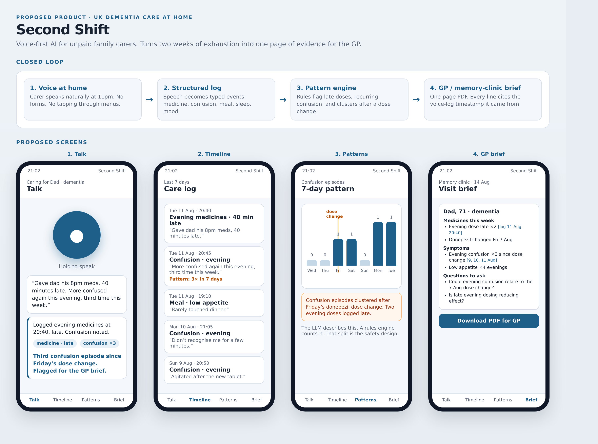
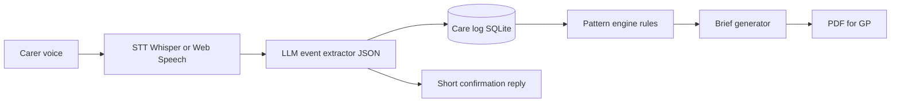
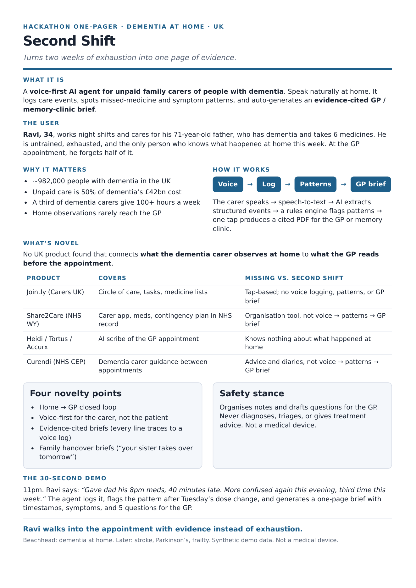

# Second Shift

**Turns two weeks of exhaustion into one page of evidence.**

A voice-first AI agent for **whoever is on the shift**: unpaid family carers **and** paid support workers in UK dementia care (home or residential). They speak or type. Second Shift logs what happened, spots patterns, writes a **shift handout**, and generates an **evidence-cited GP / memory-clinic brief**. Nurses and doctors get a **simple view** of the same person record.

**Start here:** [GUIDE.md](GUIDE.md) — what was built. Next build: [PLAN_OF_ACTION.md](PLAN_OF_ACTION.md).

This repository contains the research pack **and a working local app**. It is **not a medical device**. It organises notes and drafts questions for the GP. It does not diagnose, triage, or give medical advice.



*Talk → Timeline → Patterns → GP brief.*

---

## Run the app

**Docker (one script):**

```bash
./run.sh
```

That builds and starts the API, the website, and Ollama. Open **http://127.0.0.1:8080**. Stop with `docker compose down`.

**Without Docker** (conda env **`secondshift`**, local Whisper, host Ollama):

```bash
conda activate secondshift
# first time:
# conda env create -f environment.yml
# cd frontend && npm install && cd ..
# ollama serve   # other terminal
# ollama pull llama3.2:3b

cd backend
PYTHONPATH=. uvicorn app.main:app --reload --port 8001
```

In another terminal:

```bash
cd frontend
VITE_API_URL=http://127.0.0.1:8001 npm run dev
```

Open http://127.0.0.1:5173

- Type the Ravi line if the mic is unavailable (text fallback).
- Chrome is the demo browser (mic + SpeechSynthesis).

### Tests

```bash
conda activate secondshift
./scripts/verify_all.sh
```

Unit tests do not need Ollama. Live extraction: `python -m pytest tests/ -m live` with `ollama serve` and `llama3.2:3b` pulled.

On this machine Whisper uses CUDA then unloads so Ollama can use the 4GB GTX 1650. If JSON quality is weak, run `ollama pull qwen2.5:7b` and set `OLLAMA_MODEL=qwen2.5:7b` (CPU is fine).

---

## The problem

Staff and family change. The person receiving care does not. What happened last week (vomiting after food, late tablets, evening confusion) lives in whoever was on that shift, then disappears.

**Ravi, 34**, unpaid, cares for his father at home and forgets half the week at the GP. **Priya**, a support worker, was off last week and does not know Able vomited after meals unless the record tells her.

Both need the same loop: speak → log → patterns → handout for the next person and the GP.

| Why this matters in the UK | Figure |
|---|---|
| People living with dementia | ~982,000 (rising to 1.4 million by 2040) |
| Annual cost of dementia | ~£42 billion |
| Share that is unpaid care | 50% |
| Dementia carers giving 100+ hours a week | 1 in 3 |
| Unpaid carers visible in GP records vs Census | ~1.4% |

Sources: Alzheimer’s Society / Carnall Farrar 2024; Carers UK; Nuffield Trust comparison cited via HFMA.

Existing UK tools cover **slices** of this:

- **Jointly** and **Share2Care** organise a circle of care (tap and type).
- **Heidi / Tortus / Accurx** transcribe the GP appointment itself.
- **Curendi** and **PuntoCare** give dementia guidance or cognitive testing.
- **PASSforcare, Birdie, Nourish** digitise the paid care record (visits, eMAR, CQC). They do not turn speech into person-level recurrence memory plus a cited GP brief.

Nobody closes the loop from **what the person on shift says** to **what the next worker and the GP can read**.

---

## What we are proposing

```text
Person on shift speaks  →  speech-to-text  →  structured care events (on the person)
                                              ↓
                                    pattern engine (rules)
                                              ↓
                    shift handout  +  evidence-cited PDF for GP / nurse view
```

### Four screens (hackathon demo)

1. **Talk.** Big microphone. Ravi says: *“Gave dad his 8pm meds, 40 minutes late. More confused again this evening, third time this week.”* The agent confirms the log and flags the pattern.
2. **Timeline.** A feed of typed events (medicine, confusion, meal, sleep) with the original quote attached.
3. **Patterns.** A 7-day chart. Confusion bars rise after a donepezil dose change. Late evening doses are marked. A **rules engine** counts; the LLM only describes.
4. **GP brief.** One-page PDF: medicines given / late / missed, symptom episodes, suggested questions. Every factual line cites a voice-log timestamp.

### What we will not build in v1

- Full eMAR, rostering, or a Nourish-style DSCR.
- NHS login / GP Connect write-back.
- Diagnosis, triage, or treatment advice.
- Separate nurse vs doctor apps (one simple view is enough).

**Beachhead:** dementia. Users: family *and* paid staff. Later: stroke, Parkinson’s, frailty.

**Next build:** [PLAN_OF_ACTION.md](PLAN_OF_ACTION.md) (theme + split UI, person-first + Able, similar-last-week + cited PDF, then login/clinical view).

---

## How it works



| Layer | Role | This build |
|---|---|---|
| Frontend | Talk, timeline, patterns, brief | React + Vite + Tailwind |
| Speech in | Mic → transcript | Local Whisper `small` via faster-whisper |
| Extractor | Free speech → typed events | Ollama `llama3.2:3b` JSON (heuristic fallback) |
| Database | Append-only care log | SQLite |
| Patterns | Late doses, recurrence, dose-change clusters | Deterministic rules, not the LLM |
| Brief | Markdown → PDF with citations | Python + fpdf2 |
| Voice reply | Short confirmations | Browser SpeechSynthesis |

**Hard split:** the LLM never counts “how many times this week.” The pattern engine does. That is the safety and trust design.

---

## Why this is novel (UK)

| Product | Covers | Missing vs Second Shift |
|---|---|---|
| Jointly (Carers UK) | Circle of care, tasks, medicine lists | Voice logging, patterns, GP brief |
| Share2Care (NHS West Yorkshire) | Carer app + contingency plan in NHS record | Still tap-based organisation |
| Heidi / Tortus / Accurx | AI scribe of the GP appointment | Knows nothing about home |
| Curendi (NHS CEP) | Dementia carer guidance between appointments | Advice, not logging → brief |
| KinKeeper (UK, 2026) | Family hub; journal PDF for GPs | Not voice-first; not evidence-cited from the care log |
| Nourish / Birdie / PASSforcare | Paid-staff DSCR, visits, eMAR | Operational record, not speech → person memory → cited brief |

**Novelty scores:** concept ~6.5/10 (slices exist); integrated home→GP loop ~8.5/10; hackathon context ~9/10.

Pitch line: *Nourish digitises the paid care record. Heidi transcribes the appointment. Second Shift turns what the person on shift says into what the next worker and the GP can read.*

Full comparison, academic papers, and UK policy notes: [Second_Shift_Novelty_Research.md](Second_Shift_Novelty_Research.md).

---

## Safety and privacy

- Persistent UI: “Second Shift organises your notes. It is not a medical device and does not give medical advice.”
- Escalation language is observational: “You have logged confusion 3 times since Friday.” Never “this could be serious.”
- Emergency words (unconscious, not breathing, severe chest pain) → static screen: call 999. No LLM.
- Encrypted at rest. Discard raw audio after transcription. Export / delete on demand.
- Demo uses **synthetic** people (Ravi / Dad, Priya / Able). Say that on stage.
- Do not claim NHS-record write in a hackathon build. The worker or family **brings a PDF**.

---

## 30-second demo

> 11pm. Ravi says: “Gave dad his 8pm meds, 40 minutes late. More confused again this evening, third time this week.”
>
> The agent logs it, flags the cluster after Friday’s dose change, and generates a one-page brief with timestamps, symptoms, and questions for the GP.
>
> **Close:** Ravi walks into the appointment with evidence instead of exhaustion.
>
> Second beat (next build): Priya logs that Able ate then vomited. The app shows the same issue last week, even though she was off.

Pre-seed synthetic logs so live lines fire patterns **on stage**. Fallback ladder: live mic → pre-recorded clip → typed input → cached PDF.

---

## One-pager (share this)



Printable A4: [Second_Shift_One_Pager.pdf](Second_Shift_One_Pager.pdf) · HTML source: [Second_Shift_One_Pager.html](Second_Shift_One_Pager.html)

---

## What’s in this repo

| File | What it is |
|---|---|
| [GUIDE.md](GUIDE.md) | Section-by-section guide to what was built |
| [backend/](backend/) | FastAPI, SQLite, Whisper, Ollama, rules, PDF |
| [frontend/](frontend/) | Talk, Timeline, Patterns, Brief |
| [tests/](tests/) | pytest gates for phases 0–4 |
| [scripts/verify_all.sh](scripts/verify_all.sh) | Full verification |
| [environment.yml](environment.yml) | conda env `secondshift` |
| [IMPLEMENTATION_PHASES.md](IMPLEMENTATION_PHASES.md) | Research broken into build phases 0–5 |
| [PLAN_OF_ACTION.md](PLAN_OF_ACTION.md) | Next build: novelty loop first, then login |
| [Second_Shift_Novelty_Research.md](Second_Shift_Novelty_Research.md) | UK competitive and academic research |
| [Second_Shift_Engineering_Spec.docx](Second_Shift_Engineering_Spec.docx) | Build spec: data model, prompts, stack |
| [Second_Shift_One_Pager.pdf](Second_Shift_One_Pager.pdf) | One-page pitch |
| [docs/proposed-work.html](docs/proposed-work.html) | Interactive mockup of the four screens |
| [docs/images/](docs/images/) | Screenshots used in this README |

---

## Implementation phases (summary)

Full detail: [IMPLEMENTATION_PHASES.md](IMPLEMENTATION_PHASES.md)

| Phase | Hours | Goal |
|---|---|---|
| **0 Foundations** | 0–4 | Repo, dementia seed data, STT spike, disclaimer |
| **1 Voice → log** | 4–10 | Speech/text → structured events → Timeline |
| **2 Pattern engine** | 10–16 | Rules flag late doses + confusion after dose change |
| **3 GP brief** | 16–24 | Evidence-cited PDF (close the home → GP loop) |
| **4 Polish** | 24–40 | Chart, safety, fallbacks, optional handover brief |
| **5 Pitch only** | — | NHS write-back, full eMAR — do not build |
| **6 Next** | see plan | Theme/split UI, Able memory, cited banner, then clinical view |

If behind at hour 24: skip handover; keep voice → pattern → brief. That closed loop is the win.

This build uses React + Vite + Tailwind, FastAPI, SQLite, local Whisper, Ollama, Recharts, and fpdf2.

---

## Licence and disclaimer

Research and design for a university hackathon. **Not a medical device.** Not for clinical use. All demo data is synthetic.
